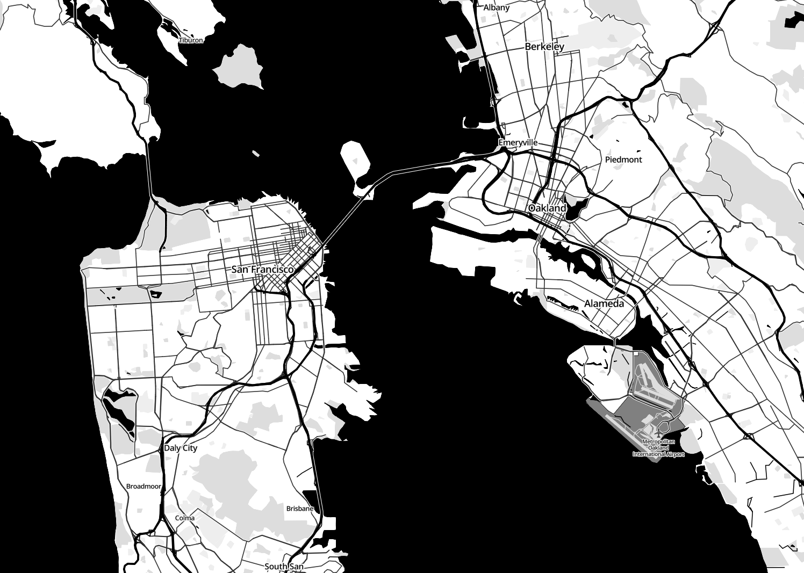

mapbox-gl-toner
===============

Highly experimental implementation of the Toner style for Mapbox GL vector rendering.

Getting started
---------------

First, get [mapbox-gl-native](https://github.com/mapbox/mapbox-gl-native) running locally.

Then, overwrite Mapbox's [style.js](https://github.com/mapbox/mapbox-gl-native/blob/master/bin/style.js) file with the `style.js` found in this repo.

Caveats
-------
This is the result of an afternoon hacking up the Mapbox GL default style. There will be _a lot_ of rough edges!

Enjoy!

